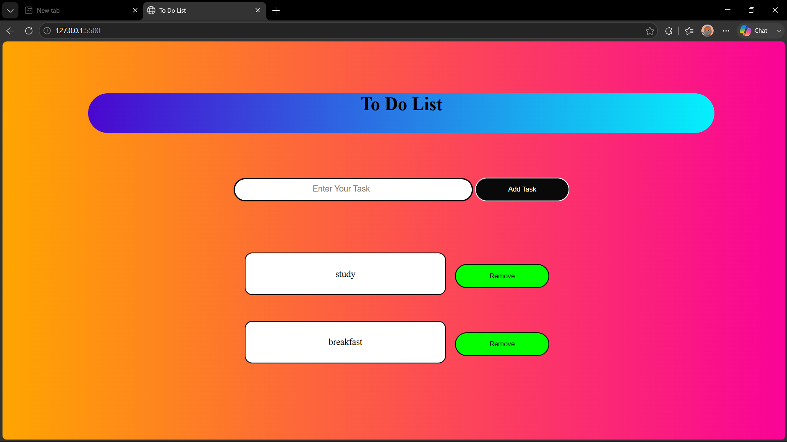

<div align="center">

# ✅ To-Do List

### Simple • Colorful • Interactive Task Manager

A clean and interactive **To-Do List web application** built with **HTML5, CSS3 and JavaScript**.

<p>
  
  
  
  
</p>

</div>

---

## 🎨 Project Showcase

<div align="center">



</div>

---

## 🖥️ Actual Application

<div align="center">


</div>

---

## ✨ Key Features

| Feature | Description |
|---|---|
| ➕ **Add Tasks** | Add new tasks instantly |
| 🗑️ **Remove Tasks** | Delete tasks with one click |
| 🚫 **Empty Task Protection** | Prevents empty tasks from being added |
| 🎨 **Colorful UI** | Gradient-based visual design |
| 🖱️ **Interactive UI** | Hover effects for buttons |
| ⚡ **Lightweight** | Built with pure HTML, CSS and JavaScript |

---

## 🛠️ Tech Stack

<div align="center">


</div>

- **HTML5** — Page structure and input elements
- **CSS3** — Layout, gradients, buttons and task-card styling
- **JavaScript** — Dynamic task creation and removal

---

## 📂 Project Structure

```text
To-Do-List/
│
├── index.html
├── style.css
├── main.js
├── todo-preview.png
├── todo-readme-showcase.png
├── todo-project-overview.png
└── README.md
```

---

## 🚀 How to Run

### 1️⃣ Download

Click **Code → Download ZIP** from this repository.

### 2️⃣ Extract

Extract the ZIP file anywhere on your computer.

### 3️⃣ Open

Open the extracted folder and double-click:

```text
index.html
```

### 4️⃣ Start Using

Enter a task and click **Add Task**.

Click **Remove** whenever you want to delete a task.

> 💡 For development, open the project in VS Code and use **Live Server**.

---

## 🔄 How It Works

```text
Enter Task
    ↓
Click "Add Task"
    ↓
JavaScript reads the input
    ↓
Creates a new task element
    ↓
Displays the task
    ↓
Click "Remove"
    ↓
Task is deleted
```

---

## 💻 Core JavaScript Logic

The main functionality is handled by the `addToDo()` function.

```javascript
function addToDo(){
    let taskvalue = document.getElementById('todoinput').value;

    if(taskvalue==""){
        return;
    }

    // Create task and remove button
}
```

JavaScript dynamically creates the task container and its **Remove** button, then adds it to the task list.

---

## 🎨 UI Design

The application uses:

- 🌈 Orange → pink gradient background
- 🔵 Blue → cyan gradient header
- ⭕ Rounded input and buttons
- 📦 White task cards
- 🟢 Remove buttons
- 🖱️ Hover interactions

---

## 🔮 Future Improvements

- [ ] Mark tasks as completed
- [ ] Edit existing tasks
- [ ] Save tasks with Local Storage
- [ ] Add due dates
- [ ] Add task categories
- [ ] Add task priority
- [ ] Add Clear All button
- [ ] Add task counter
- [ ] Add dark mode
- [ ] Improve mobile responsiveness

---

## 📸 More Visuals

<div align="center">


</div>

---

## 👨‍💻 Author

<div align="center">

### **Srini**

**B.Tech Information Technology Student**

Passionate about Web Development and building practical projects.

</div>

---

<div align="center">

⭐ **If you like this project, give the repository a star!**

### Built with ❤️ using HTML, CSS & JavaScript

</div>
