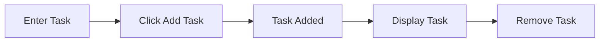

# 🎯 Modern To Do List Application

<div align="center">

# 🚀 To Do List Web App

### Organize Your Tasks • Stay Productive • Get Things Done


<br>


</div>

---

## 📸 Project Preview

<p align="center">

</p>

### ✨ Clean Interface
A modern task management application with an attractive UI and smooth user experience.

---

## 🌟 Key Highlights

🔥 Modern Gradient Design  
🔥 Dynamic Task Creation  
🔥 Responsive Layout  
🔥 Interactive Hover Effects  
🔥 Real-Time DOM Manipulation  
🔥 Beginner-Friendly Code Structure  
🔥 Lightweight & Fast Performance

---

## 🎨 UI Features

| Feature | Description |
|----------|-------------|
| 🎯 Modern Layout | Clean and user-friendly interface |
| 🌈 Gradient Background | Attractive visual appearance |
| ⚡ Smooth Interaction | Fast task management |
| 📱 Responsive Design | Works on desktop and mobile |
| 🖱️ Interactive Buttons | Hover animations and effects |

---

## 🛠️ Tech Stack

<div align="center">

| Frontend | Styling | Logic |
|-----------|----------|--------|
| HTML5 | CSS3 | JavaScript |

</div>

---

## 📂 Folder Structure

```bash
📦 ToDo-List-App
 ┣ 📜 index.html
 ┣ 📜 style.css
 ┣ 📜 main.js
 ┗ 📜 README.md
```

---

## ⚙️ Application Workflow



---

## 🎓 Skills Demonstrated

- DOM Manipulation
- Event Handling
- Dynamic Elements
- CSS Positioning
- Responsive Design
- JavaScript Functions
- UI Development

---

## 🚀 Future Improvements

- ✅ Task Completion Checkbox
- ✅ Local Storage Support
- ✅ Edit Existing Tasks
- ✅ Dark Mode
- ✅ Task Priority Levels
- ✅ Due Date System
- ✅ Search Functionality

---

## 💼 Suitable For

✔ Internship Portfolio  
✔ College Mini Project  
✔ Frontend Development Practice  
✔ GitHub Portfolio Showcase

---

## 👨‍💻 Developer

### Srinivasan V
**B.Tech Information Technology**  
Agni College of Technology

---

## ⭐ Support

If you found this project useful:

🌟 Star the Repository  
🍴 Fork the Project  
📢 Share with Others

---

<div align="center">

# 🚀 Thank You For Visiting!

### Made with ❤️ using HTML, CSS & JavaScript

</div>
